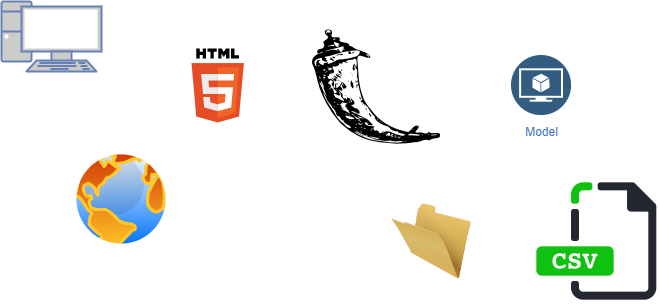

# Stock-Market-Prediction-using-LSTM-NN
Final year project COMP3000, using Long Short Term Memory to predict future stock market trends

The goal for this project is to allow users to upload files of stock market data, process that data through a model, 
and produce both a graphical and numerical prediction for the stock values, time frame is to be determined.

Must install python before doing imports.

My contact details: jaime.kershawbrown@students.plymouth.ac.uk

Supervisor: David Walker

## Architecture
  

[Click here to edit diagram](https://app.diagrams.net/#Hjkershawbrown%2FStock-Market-Prediction-using-LSTM-NN%2Fmain%2FFYP_Architecture.png)

### Instructions for deploying on AWS:

0. open putty with saved AWS session

1. cd into below dir	
/home/ubuntu/Stock-Market-Prediction-using-LSTM-NN/StockModel2/.vscode

2. create virtual environment
python3 -m venv venv

3. activate virtual environment
source venv/bin/activate

4. 
git checkout to correct branch

5. 
pip install -r requirements.txt

6. if new installs needed 
pip freeze > requirements.txt 

7. to start
python3 server.py 

8. go to link below to view deployment
ec2-54-201-179-80.us-west-2.compute.amazonaws.com:5000

Notes for improvements:
