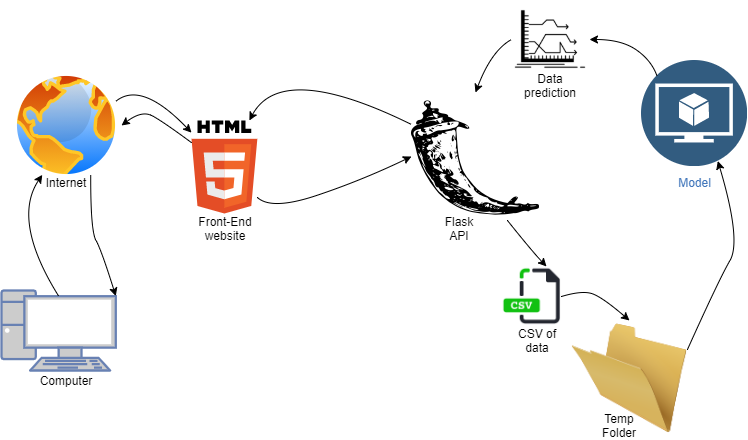

# Stock-Market-Prediction-using-LSTM-NN
This reporitory contains the project for a final year project for module code COMP3000 on the Computer Science course at Plymouth University. The core objective is to have a Long Short-Term Memory time series model forecast future stock market price trends.

There are two main sections, the research into developing the model, and the application side which contains the model and allows users to upload their own files to recieve a graphical plot of the results, and statistical performance measuremants. 

The machine learning is developed using python, with Tensorflow as the core libary, and also acts as the back-end code for the application. Flask is the chosen API, connecting to Javascript, CSS and HTML for the front end. A list of libaries needed for the application can be found in the file requirements.txt

My contact details: jaime.kershawbrown@students.plymouth.ac.uk

Supervisor: David Walker

## Architecture
  

[Click here to edit diagram](https://app.diagrams.net/#Hjkershawbrown%2FStock-Market-Prediction-using-LSTM-NN%2Fmain%2FFYP_Architecture.png)

# Link to to-do list

[To-do list for deployment + other](ToDo.md)

## Instructions for building 

- Set up a python environment for python version 3.7

- The file in the below file path is the one to start the application
	
	`/home/ubuntu/Stock-Market-Prediction-using-LSTM-NN/StockModel2/.vscode/server.py`

## Instructions for deploying on AWS:

- open putty with saved AWS session

- cd into below dir  	

	`/home/ubuntu/Stock-Market-Prediction-using-LSTM-NN/StockModel2/.vscode`

- create virtual environment  

	`python3 -m venv venv`

- activate virtual environment

	`source venv/bin/activate`

- go to correct branch

	`git checkout <correct branch>`

- install required libraries

	`pip install -r requirements.txt`

- if new installs needed then pip install and run line below

	`pip freeze > requirements.txt`

- to start application

    `python3 server.py`

- go to link below to view deployment, subject to change

[click here](http://ec2-54-201-179-80.us-west-2.compute.amazonaws.com:5000)

## Instructions for testing application:

- Complete the deployment instructions above first.

- Go to the hosting link, view index page, and terms of service page to make sure the html/css loads correctly.

- Go to [Yahoo Finance](https://uk.finance.yahoo.com/) type in TSLA for the tesla stock. Click on historical data, and click download for the CSV file.

- Return to the application page, then agree to terms of service, and click the 'browse' button to select the CSV file, and then choose the stock sector "Technology", and click the 'upload button'. Wait a few seconds, and the results should be plotted to a graph. If nothing happens after 10 seconds, something has gone wrong, and start trouble shooting.

- Similarly, click the second 'browse' button and select a forecasting model of your own, and then click the second 'upload' button, wait 10 seconds and the testing results should be plotted. If not, start trouble shooting.